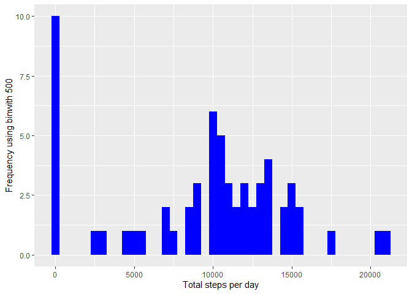
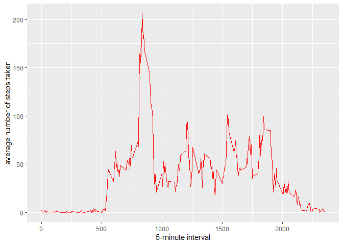
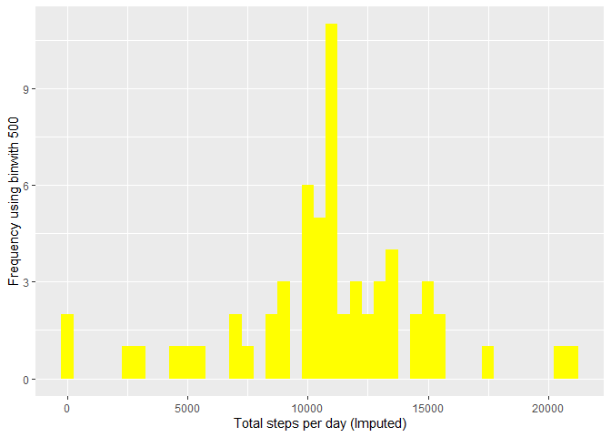
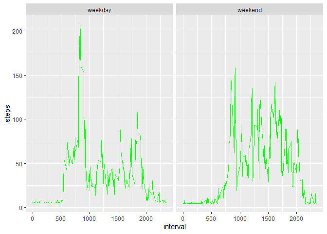

## Loading and preprocessing the data

##### 1. Load the data (i.e. read.csv())


```r
fiename <- "activity.zip"

if (!file.exists(fiename)) {
  fileURL <- "https://d396qusza40orc.cloudfront.net/repdata%2Fdata%2Factivity.zip"
  download.file(fileURL, fiename)
}
unzip(fiename)
data <- read.csv('activity.csv', header = TRUE)
```

##### 2. Process/transform the data (if necessary) into a format suitable for your analysis

```r
data$date<-as.Date(data$date)
```

-----

## What is mean total number of steps taken per day?

##### 1. Make a histogram of the total number of steps taken each day

```r
stepsByDay <- tapply(data$steps, data$date, sum, na.rm=TRUE)
qplot(stepsByDay, xlab='Total steps per day', ylab='Frequency using binwith 500', binwidth=500, fill = I("blue"))
```

<!-- -->

##### 2. Calculate and report the mean and median total number of steps taken per day

```r
mean(stepsByDay)
```

```
## [1] 9354.23
```

```r
median(stepsByDay)
```

```
## [1] 10395
```

-----

## What is the average daily activity pattern?

##### 1. Make a time series plot

```r
averageStepsPerTimeBlock <- aggregate(x=list(meanSteps=data$steps), by=list(interval=data$interval), FUN=mean, na.rm=TRUE)
ggplot(data=averageStepsPerTimeBlock, aes(x=interval, y=meanSteps)) +
    geom_line(color = "red") +
    xlab("5-minute interval") +
    ylab("average number of steps taken") 
```

<!-- -->

##### 2. Which 5-minute interval, on average across all the days in the dataset, contains the maximum number of steps?

```r
mostSteps <- which.max(averageStepsPerTimeBlock$meanSteps)
gsub("([0-9]{1,2})([0-9]{2})", "\\1:\\2", averageStepsPerTimeBlock[mostSteps,'interval'])
```

```
## [1] "8:35"
```

-----

## Imputing missing values

##### 1. Calculate and report the total number of missing values in the dataset 

```r
length(which(is.na(data$steps)))
```

```
## [1] 2304
```

##### 2. Devise a strategy for filling in all of the missing values in the dataset.
##### 3. Create a new dataset that is equal to the original dataset but with the missing data filled in.

```r
activityDataImputed <- data$steps[is.na(data$steps)]<-mean(data$steps,na.rm=TRUE)
```


##### 4. Make a histogram of the total number of steps taken each day 

```r
sum_steps<-aggregate(data$steps,by=list(data$date),FUN=sum,na.rm=TRUE)

qplot(sum_steps$x, xlab='Total steps per day (Imputed)', ylab='Frequency using binwith 500', binwidth=500, fill = I("yellow") )
```

<!-- -->

-----

## Are there differences in activity patterns between weekdays and weekends?


```r
data$days=tolower(weekdays(data$date))

data$day_type<-ifelse(data$days=="saturday"|data$days=="sunday","weekend","weekday")

avg_steps<-aggregate(data$steps,by=list(data$interval,data$day_type),FUN=mean,na.rm=TRUE)

colnames(avg_steps)<-c("interval","day_type","steps")

ggplot(aes(x=interval,y=steps),data=avg_steps)+
  geom_line(color='green')+
  facet_wrap(~avg_steps$day_type)
```

<!-- -->
